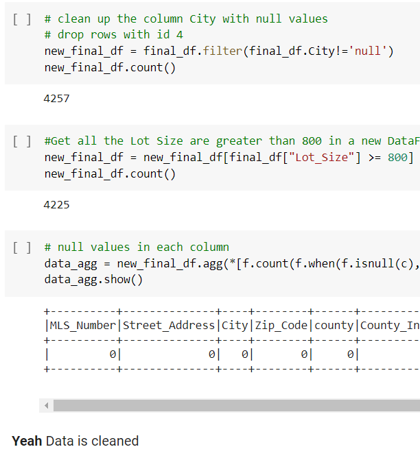
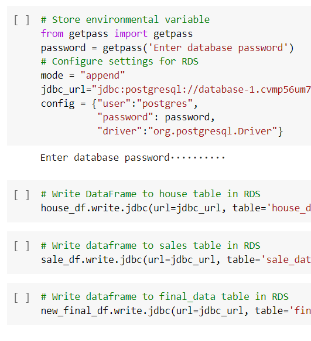
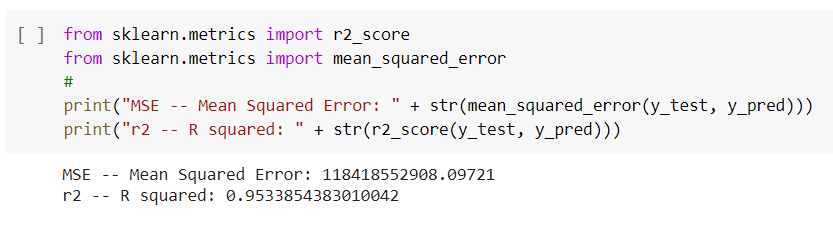
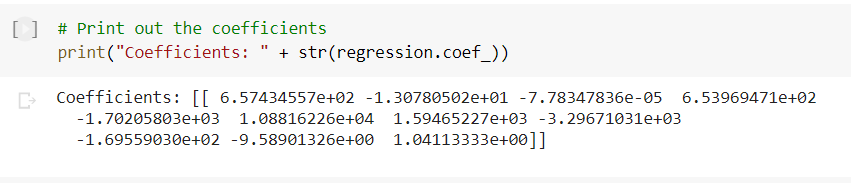

# Housing Price analysis in CA (Final_Group_Project) 

# Predicting CA Housing Prices  
In this project, we will Predict the average housing prices per SQF for each county in CA. Then we will Visualize the housing prices per county on a Map. 
We will build Machine Learning Models to help investors and homeowners assess the housing prices in California based on Housing transactions. We will build a  supervised neural network machine learning model using the following independent parameters, Zip Code, House Age, SQFT, and Days on Market.

## Data Source
1) MLS Data, https://pro.mlslistings.com/, is deposited at "amazonaws.com" with the name 'big_main.csv". The dataset includes 4344 housing sale transactions in California for the period from 6/2020 till 6/2020. The dataset includes Street_Address	City, Zip_Code, SqFtTotal, Lot_Size, Age, BathsTotal, BedsTotal, BathsFull, BathsHalf, DOM, Year_Sold, Year_List, List_Price, Sale_Price, Listing_Date, Sale_Date, Year_Built. 

2) Additional Data set includes "county_zipcode.csv" which was deposited at "amazonaws.com". This files lists all the Zip Codes to County Name.

## Questions we Hope to answer:
Motivation, Housing prices are a hot topic, especially During the COVID-19 Pandemic (Leading to increased demand for housing). We strive to build a Machine learning model to Guide investors, Potential Buyers, or Real estate professionals on housing prices per county. 
    1. we Will Build a supervised Neural Machine learning model using  House Age, SQF, Lot size & Days on the Market to predict the median House Price per SQF for the county. 

## Communications Protocols:
o	Members: Trong Quyen, Srividhya Thirumalairajan, Dawit Alaro, Angelica Villanueva & Mikhail Zaatra

##    Segment 1:
• Roles and Responsibilities:
    o	Presentation : Mikhail Zaatra
    o	GitHub: Srividhya Thirumalairajan
    o	Machine Learning Model : Trong Quyen , Angelica Villanueva,  Srividhya Thirumalairajan & Mikhail Zaatra
    o	DataBase: Dawit Alaro  & Angelica Villanueva
    o	DashBoard: N/A 
    
• Project Tools: Collaboration: 
    o	Communication Methods: 
    o	GitHub will be the Main tool for Documents and Code Development. 
    o	- Sharing resources via slack
    o	- using zoom meeting every Thursday as well from 7-9 to work on the project
    
##    Segment 2:

•	Final_data_processing.ipynb:
*   Use google Colab and pyspark, and process this online
*   Combine two data sources mentioned above "big_main.csv" and "county_zipcode.csv"
*   Use "StringIndex" from 'pyspark.ml.feature import' to assign a county name a number
*   Joined two data sets together.  Cleaned up and deleted null values.  
*   Export the data to postgresql.  There are three sets of data exported: 'house_data.csv', 'sale_data.csv' and 'final_data.csv'.  

•	Regression_Basic.ipynb
* 	Read the 'final_data.csv' from AWS
*   The data has 4225 records. That amount is split 95% for training and 5% for testing.
*   That split means 4013 records are for training and 212 records for testing 
*   The result is impressive, with R squared is 95%.  The model can explain 95% of the price variation.  
*   The coefficients for the colums "County_Index|SqFtTotal|Lot_Size|Age|BathsTotal|BedsTotal|BathsFull|BathsHalf|DOM|Year_Sold|List_Price" is below:  
*   With this, one can build an estimate calculator.
*   With the coefficients above, we applied the coefficient to all the sales, and created a new column "Predicted Value".
*   "final_data.csv" with an extra column of "Predicted Value" is saved as "final_prediction_all.csv". This "final_prediction_all" will be used for mapping and visualization.

    

•	Roles and Responsibilities:
*   Presentation : Mikhail Zaatra
*   GitHub: Srividhya Thirumalairajan
*   Machine Learning Model : Trong Quyen , Srividhya Thirumalairajan & Mikhail Zaatra
*   DataBase: Dawit Alaro  & Angelica Villanueva
*   DashBoard: N/A 

